# job4j_cars

### О проекте

Cайт по продаже машин.

### Описание

1. На сайте представлены объявления.
2. В объявлении имеются: описание, марка машины, тип кузова, фото.
3. Объявление имеет статус "продано" или "актуально".

Система доступна только аутенифицированному пользователю:
первоначально пользователь попадает на страницу авторизации, где он может пройти аутеницикацию путемм ввода логина и
пароля.
Так же он может зарегистрироваться. При этом логин должен быть уникален: в системе не можем быть более одного
пользователя
с данным логином.
При неуспешной регистрации пользователь снова попадает на страницу регистрации, при этом выводится сообщение об ошибке.
При успешной авторизации пользователь может видеть и управлять списком дел. Также есть возможность разлогиниться.
При неуспешной авторизации пользователю снова предоставляется страница для ввода логина и пароля, на которой выводится
сообщение
об ошибке.

У объявления есть название, описание, дата создания и статус: "Продано"/"Актуально".
Пользователь может:

1. Совершать следующие действия над объявлением:

- создавать новое объяление (со страницы общего списка); объяление создается со статусом "Актульное"
- просматривать подробное описание
- удалять
- редактировать
- переводить объявление со статусом "Актуальное" в статус "Продано" - может только автор объявления.

2. выводить списки:

- все
- продано
- актуально

3. При успешном обновлении объявления или переводе его в статус "Продано", на информационной странице об успешном
   выполнении
   операции есть ссылка перехода на основную страницу списка "Все".
4. При успешном удалении объявления происходит переход на основную страницу.
5. Операции удаления, перевода объявления в статус "Продано" и "Удаление" доступны со страницы подробного описания
   объявления.
6. Операция добавления доступна со страницы списка "Все".

### Стек технологий

Java 17, Spring Boot 3, Thymeleaf, Liquibase, Sql2o 1, PostgreSQL, Hibernate, MapStruct 1.5.5.Final

### Требования к окружению

Java 17, Maven 3.4.0, PostgreSQL

### Запуск проекта

``` create database cinema;  ```
``` mvn clean install  ```
и далее запускаем приложение

### Взаимодействие с приложением

#### Скриншоты

##### *Страница авторизации*

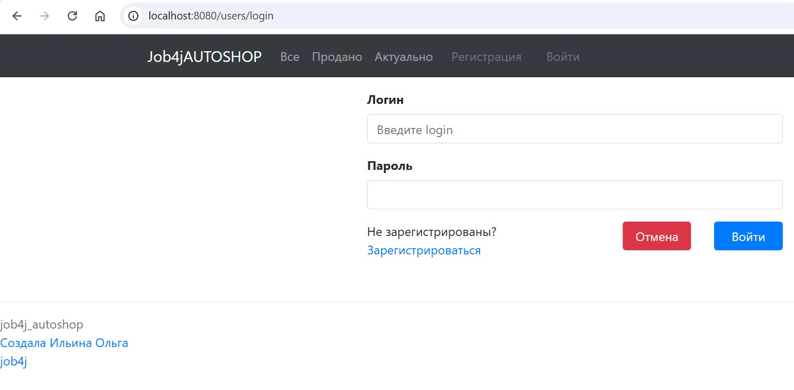

##### *Страница авторизации с сообщением о неуспешной авторизации*

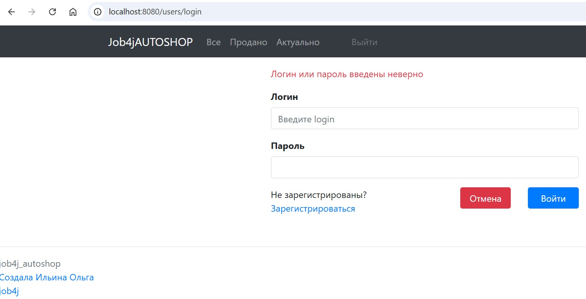

##### *Страница регистрации*

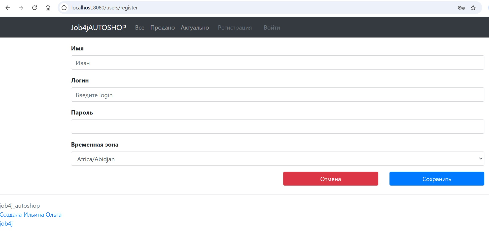

##### *Страница регистрации с сообщением о неуспешной регистрации*

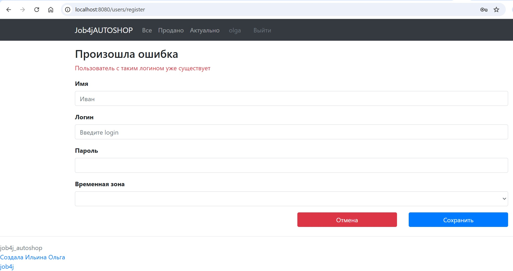

##### *Страница списка всех объявлений (нет объявлений в системе)*

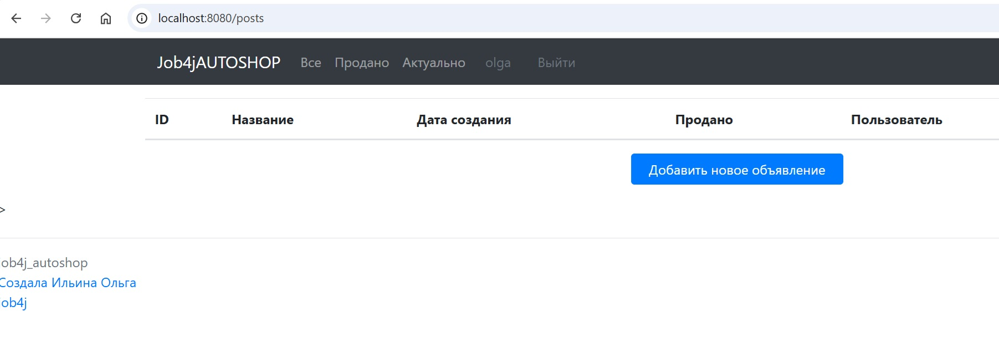

##### *Страница списка всех объявлений*

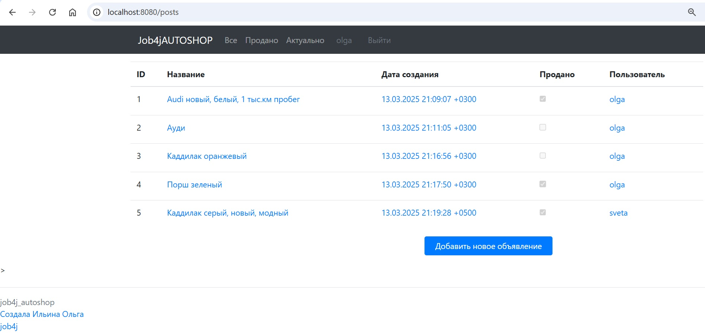

##### *Страница списка объявлений со статусом "Актуально"*

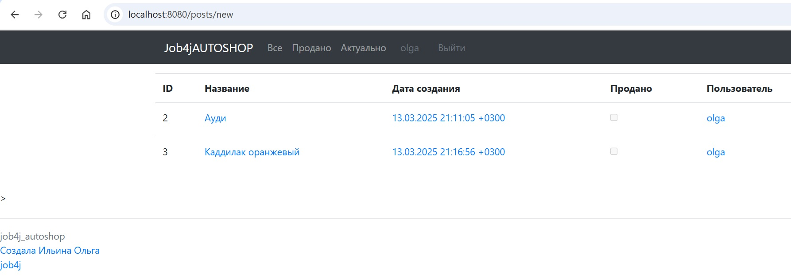

##### *Страница списка объявлений со статусом "Продано"*

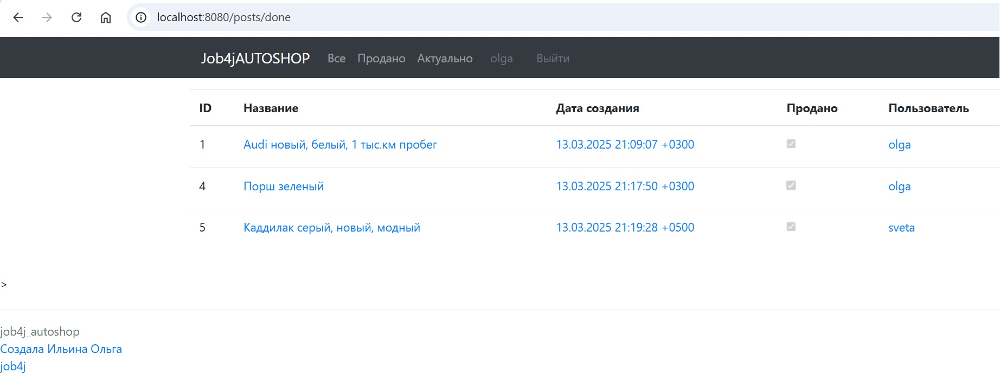

##### *Страница создания объявления*

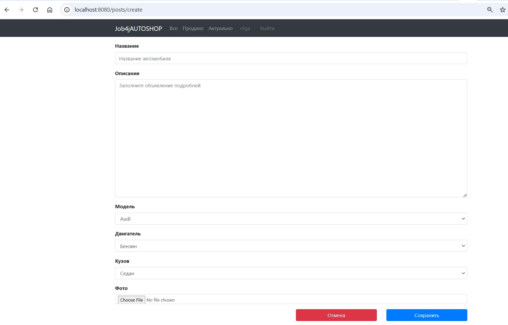


##### *Страница с сообщением об успешном создании объявления*

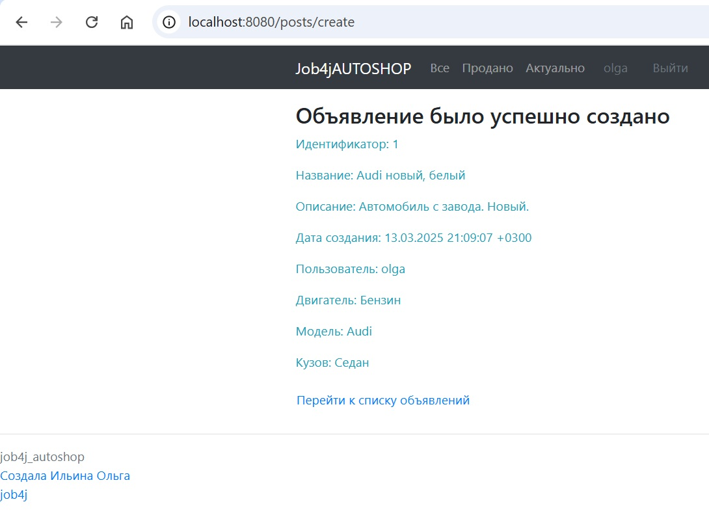

##### *Страница редактирования объявления*

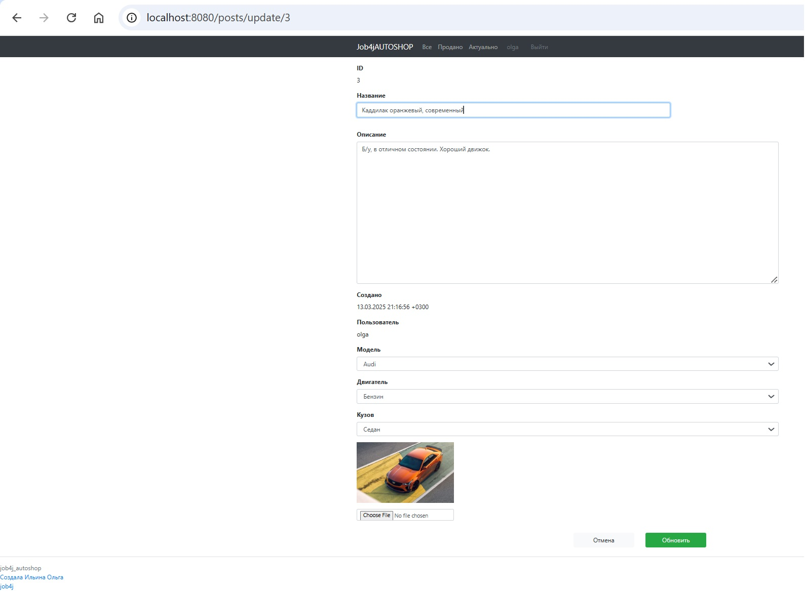

##### *Страница с сообщением об успешном обновлении объявления*

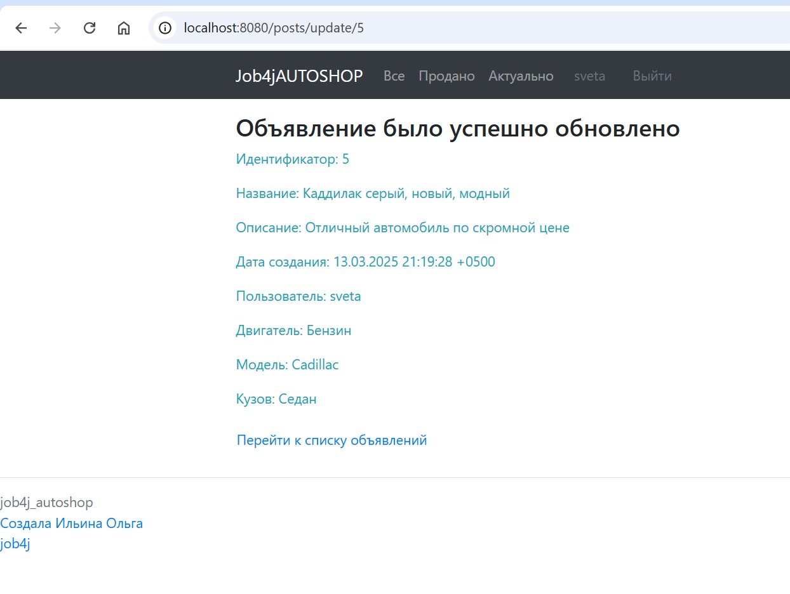

##### *Страница с сообщением об успешном переводе объявления в статус "Продано"*

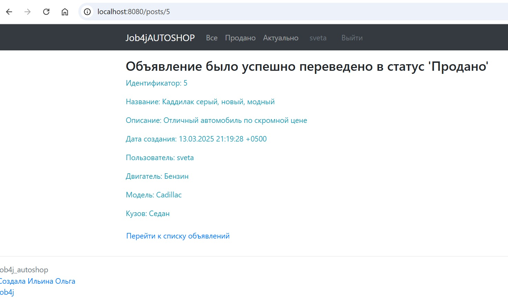

##### *Страница просмотра объявления в статусе "Продано" - просматривает автор*

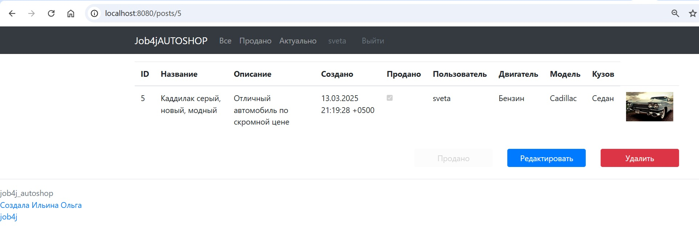

##### *Страница просмотра объявления в статусе "Продано" - просматривает не автор*

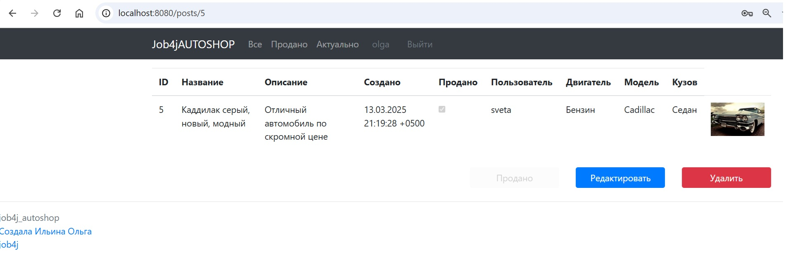

##### *Страница просмотра объявления в статусе "Актуально" - просматривает автор*

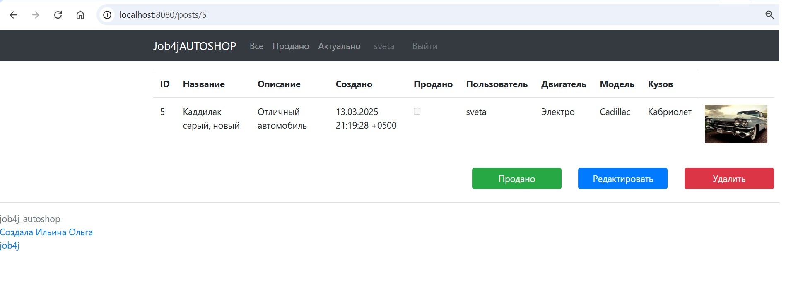

##### *Страница просмотра объявления в статусе "Актуально" - просматривает не автор*

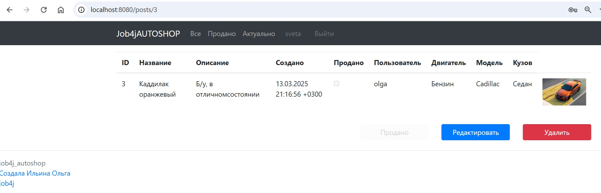

##### *Примеры страниц в результате неуспешной операции (например, сбои в БД)*

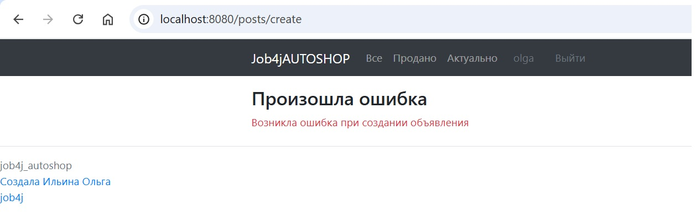
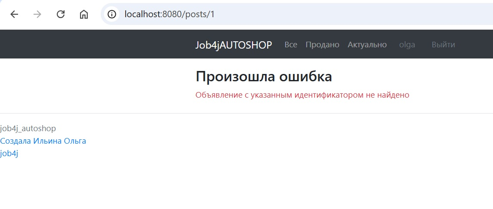

#### API

|      |                    |                                                                     |
|------|--------------------|---------------------------------------------------------------------|
| CET  | /users/login       | Авторизация                                                         |
| POST | /users/login       | Авторизация                                                         |
| CET  | /users/logout      | Выход из системы                                                    |
| POST | /users/register    | Регистрация                                                         |
| CET  | /                  | Основная страница - переадресация на страницу списка всех объявлений |
| CET  | /index             | Основная страница - переадресация на страницу списка всех объявлений |
| CET  | /posts             | Список всех объявлений                                              |
| GET  | /create            | Создание объявления                                                 |
| POST | /create            | Создание объявления                                                 |
| GET  | /posts/{id}        | Просмотр объявления                                                 |
| GET  | /posts/update/{id} | Редактирование объявления с идентификатором id                      |
| POST | /posts/update/{id} | Редактирование объявления с идентификатором id                      |
| GET  | /posts/done        | Список всех объявлений в статусе "Продано"                          |
| GET  | /posts/new         | Список всех объявлений в статусе "Актуально"                        |
| POST | /posts/delete/{id} | Удаление объявления с идентификатором id                            |
|      |                    |                                                                     |

### Контакты


- Telegram: [@OlgaIlyina0312](https://t.me/OlgaIlyina0312)
- Email:    [oliljina@mail.ru](oliljina@mail.ru)
